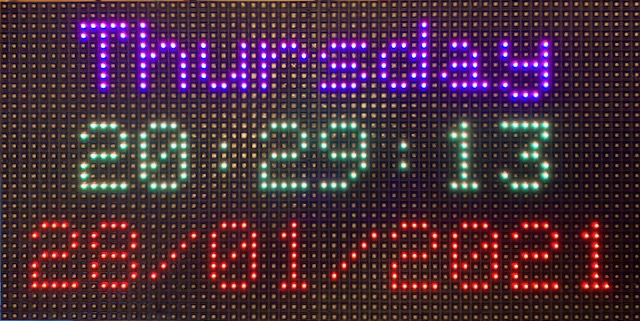
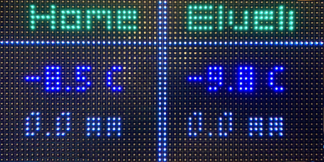

# Weather Matrix

<dl>
  <dt>Controller</dt>
  <dd>ESP32 - LOLIN D32</dd>
  <dt>LED Matrix</dt>
  <dd>HUB75 - 6mm pitch</dd>
</dl>

## Screens

### Clock

Syncs NTP every 4 hours.

### Weather

API Used: [Location Forecast 2.0 - Compact](https://api.met.no/weatherapi/locationforecast/2.0/documentation#!/data/get_compact)

<dl>
  <dt>Locations</dt>
  <dd>Home and Stables</dd>
  <dt>Temperature</dt>
  <dd>Instant > Air Temperature</dd>
  <dt>Precipitation</dt>
  <dd>Next 1 Hour > Precipitation</dd>
</dl>

